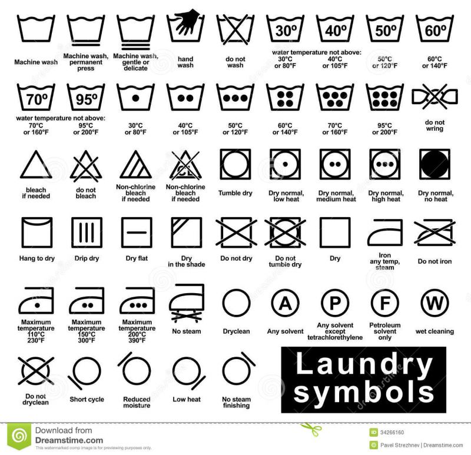

# 마크다운 문법

# 제목

## heading2

### heading3

#### heading4

`#`으로 제목을 표현할 수 있다.

## 목록

* 순서가 없는 목록
* 순서가 없는 목록
  * tab을 하면 하위 레벨
  * 하위레벨에서 나가려면 shift+tab

* 목록

1. 순서가 있는 목록
2. 순서가 있는 목록
   1. tab으로 하위레벨
   2. 하위레벨에서 상위레벨로 가려면 shift+tab
3. dfdf


```python
print('hi')
for i in range(3):
    print('hiz')
```


```html
print('hi')
<h1>
    
</h1>
```


### 링크

[구글](https://google.com)

# 이미지





## 기타

**굵게(볼드)**

*기울임(이탤릭)*

~~취소선~~

## 표


| 순서 |      |      |
| ---- | ---- | ---- |
| 1    |      |      |
| 2    |      |      |
| 3    |      |      |

